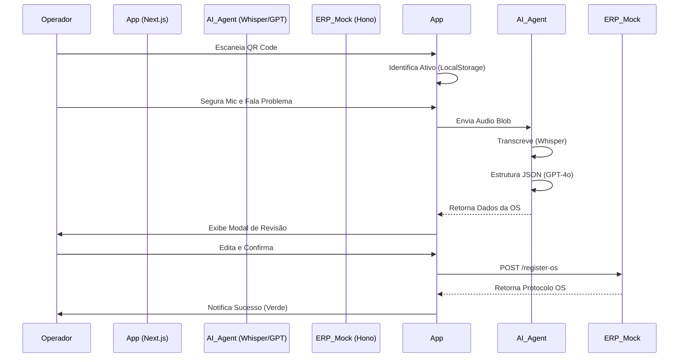
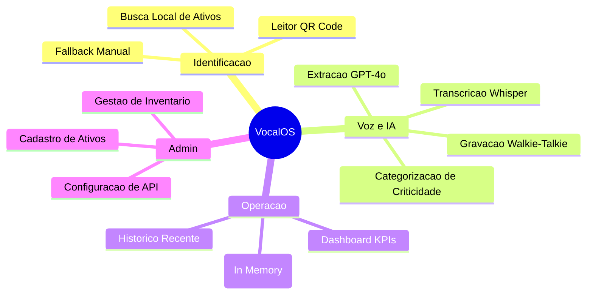
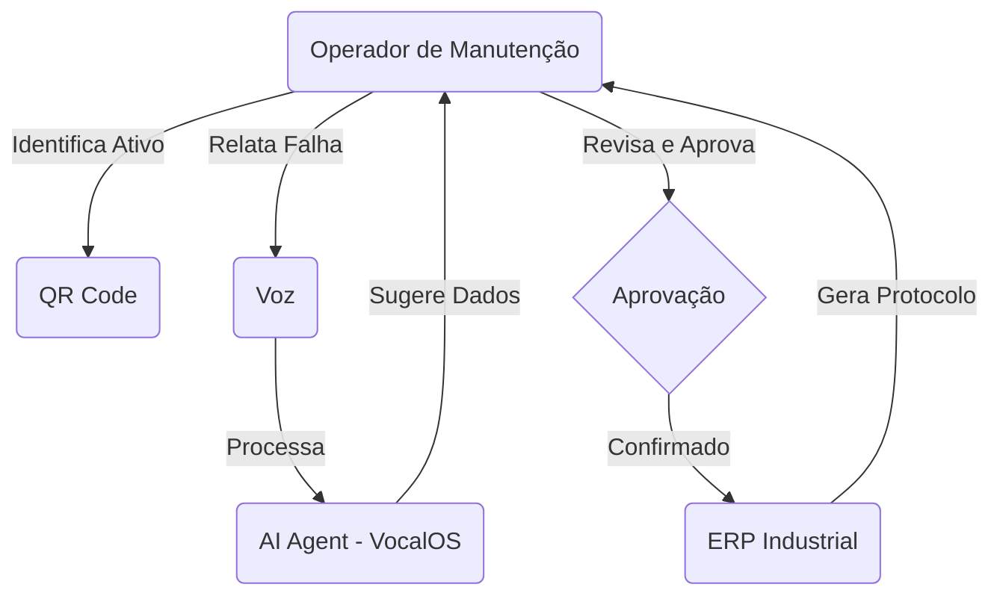
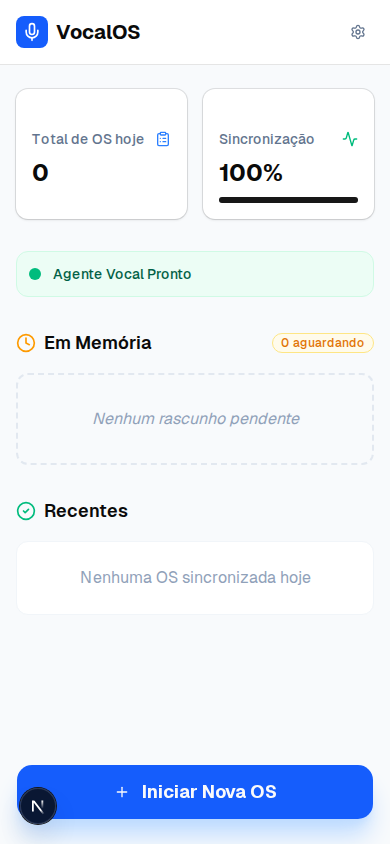
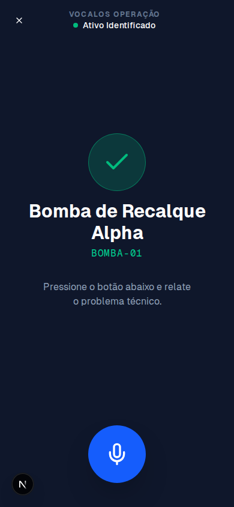
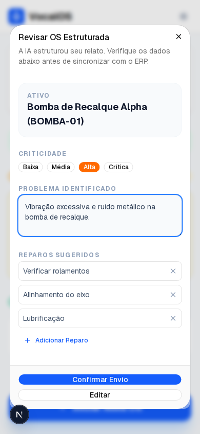
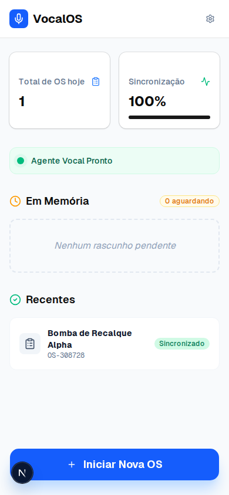

# Documentação Técnica e de Negócio: VocalOS (Project Echo)

## 1. Visão Geral do Negócio (Business Context)

### 1.1. O Problema
No ambiente industrial 4.0, a entrada de dados continua sendo um gargalo. Operadores de manutenção enfrentam dificuldades para documentar falhas em terminais fixos ou teclados convencionais, especialmente quando utilizam EPIs (luvas) ou estão em locais de difícil acesso. Isso gera:
- **Baixa qualidade dos dados**: Relatos incompletos ou imprecisos.
- **Latência na manutenção**: Atraso entre a detecção da falha e a abertura da OS.
- **Subutilização do ERP**: O sistema de gestão não reflete o estado real da planta em tempo real.

### 1.2. A Solução: VocalOS
Uma interface de voz ("Walkie-Talkie") integrada com IA Generativa que transforma relatos informais em dados estruturados. O operador apenas escaneia o ativo e fala o problema; a IA cuida da burocracia.

### 1.3. Proposta de Valor
- **Redução de Fricção**: Interface otimizada para uso com o polegar e comando de voz.
- **Precisão Técnica**: Extração estruturada (problema, criticidade, reparos) via GPT-4o.
- **Integração Fluida**: Mock ERP via Hono.js demonstrando a sincronização imediata.

---

## 2. Arquitetura Técnica

### 2.1. Stack Tecnológica
- **Frontend**: Next.js 14+ (App Router), Tailwind CSS v4, Shadcn UI.
- **IA/Orquestração**: Vercel AI SDK, OpenAI Whisper (Transcrição), GPT-4o (Extração).
- **Backend Mock**: Hono.js rodando em Edge Functions (`/api/erp-mock`).
- **Persistência**: Browser Storage API (LocalStorage para inventário e rascunhos).
- **PWA**: Suporte para instalação em Home Screen e modo offline básico.

### 2.2. Fluxo de Dados (Sequência)



### 2.3. Mapa Mental de Funcionalidades (Mind Map)



---

## 3. Casos de Uso (Use Cases)



### 3.1. Caso de Uso: Abertura de OS Emergencial
- **Ator**: Operador de Manutenção.
- **Pré-condição**: Ativo cadastrado no inventário local.
- **Fluxo Principal**:
  1. O operador clica em "Iniciar Nova OS".
  2. Escaneia o QR Code do motor/bomba.
  3. Segura o botão de microfone e diz: "A bomba está vibrando muito e cheira a queimado".
  4. A IA processa e sugere: Criticidade "Crítica", Problema "Vibração e superaquecimento", Reparos "Verificar enrolamento e isolamento".
  5. O operador revisa e clica em "Confirmar".
  6. O sistema gera o número de OS e sincroniza.

---

## 4. Guia de Implementação

### 4.1. Estrutura de Pastas
- `/src/app/admin`: Gestão de Ativos.
- `/src/app/scanner`: Interface de Captura (Câmera + Áudio).
- `/src/app/api/agent`: Orquestração de IA (Vercel AI SDK).
- `/src/app/api/erp-mock`: Endpoints Hono para simular o backend industrial.
- `/src/components/ui`: Componentes Shadcn reutilizáveis.

### 4.2. Variáveis de Ambiente
```env
OPENAI_API_KEY=sua_chave_aqui
```

---

## 5. Próximos Passos (Roadmap)
1. **Offline-First**: Sincronização em background quando houver queda de rede na fábrica.
2. **Integração SAP/TOTVS**: Substituir o Mock ERP por conectores reais.
3. **Multilingue**: Suporte a termos técnicos regionais específicos.

---

## 6. Screenshots do Sistema (PoC)

### 6.1. Dashboard Principal
Interface limpa com KPIs de OS diárias e status de sincronização em tempo real.


### 6.2. Identificação de Ativo
Leitor de QR Code integrado com feedback de identificação imediata.


### 6.3. Revisão Estruturada pela IA
O coração da usabilidade: a IA estrutura o relato informal e permite a revisão humana antes do envio.


### 6.4. Sincronização de Sucesso
OS registrada no ERP com número de protocolo oficial e mudança de cor para Verde (Sucesso).

