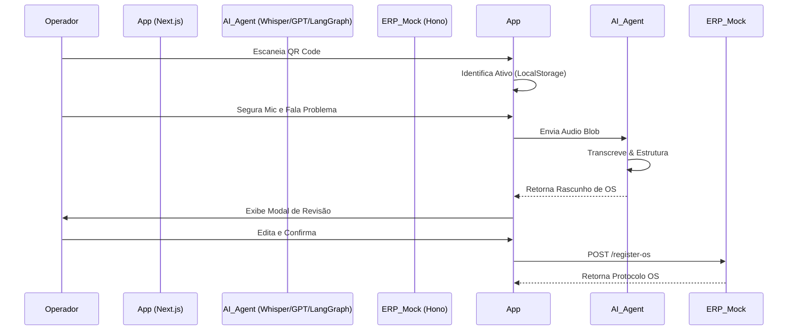

# VocalOS (Project Echo) - Agente de Voz para OS Industrial

 <!-- Referência ao PWA -->

VocalOS é uma Prova de Conceito (PoC) de um agente de voz inteligente projetado para o chão de fábrica. Ele permite que operadores de manutenção abram Ordens de Serviço (OS) de forma rápida e precisa usando apenas a voz e escaneamento de QR Code.

---

## 🚀 Demonstração Rápida

| Dashboard | Scanner & Voz | Revisão de IA |
| :---: | :---: | :---: |
|  |  |  |

---

## 🧠 O Problema e a Solução

**O Problema**: Operadores perdem tempo precioso e geram dados de baixa qualidade ao digitar relatórios técnicos em terminais fixos, muitas vezes usando luvas ou em posições desconfortáveis.

**A Solução**: "Diga o problema, a IA estrutura o dado". O VocalOS utiliza:
1. **Identificação**: QR Code para reconhecimento imediato do ativo.
2. **Voz**: Interface "Walkie-Talkie" para relato informal.
3. **IA Generativa**: Whisper (transcrição) + GPT-4o (estruturação) via **LangGraph**.
4. **Sincronização**: Envio direto para o ERP após aprovação humana.

---

## 🛠️ Arquitetura e Fluxo

O projeto utiliza **LangGraph** para orquestrar o estado da OS desde a captura até a sincronização.

### Fluxo de Dados (Sequência)


---

## ⚙️ Tecnologias Utilizadas

- **Framework**: Next.js 15+ (App Router)
- **Estilização**: Tailwind CSS v4 + Shadcn UI
- **Orquestração de IA**: LangChain.js + LangGraph
- **Modelos**: OpenAI GPT-4o & Whisper-1
- **Backend Mock**: Hono.js em Edge Functions
- **PWA**: Suporte para instalação e modo mobile-first

---

## 📦 Como Executar

1. **Instale as dependências**:
   ```bash
   npm install --legacy-peer-deps
   ```

2. **Configure as variáveis de ambiente**:
   Crie um arquivo `.env` na raiz:
   ```env
   OPENAI_API_KEY=sua_chave_aqui
   ```

3. **Inicie o servidor de desenvolvimento**:
   ```bash
   npm run dev
   ```

4. **Acesse**: `http://localhost:3000`

---

## 📋 Documentação Completa

Para detalhes profundos sobre regras de negócio, arquitetura de software e guias de implementação, consulte a [**Documentação Técnica e de Negócio (DOCUMENTATION.md)**](./DOCUMENTATION.md).
